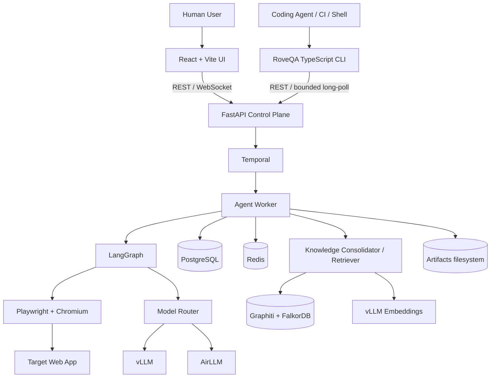

# Architecture

## Context diagram



## Runtime responsibilities

### React/Vite
Control y observación humana: projects, stories, plans, runs, timeline, live state, findings, evidence y knowledge browser. Es un Interface/Delivery adapter; no contiene reglas del runtime.

### RoveQA CLI
Interfaz determinista para coding agents, CI y shell. Sólo consume el API público de FastAPI. Proporciona:
- `setup/doctor`;
- plan scaffold/lint;
- create/get/wait/cancel/rerun/diff/flaky;
- artifact/failure bundle materialization;
- JSON stdout estable y exit codes públicos;
- instalación opcional de una skill de verificación para coding agents.

La CLI **no** invoca directamente Playwright, Temporal, LangGraph, Redis, PostgreSQL ni los modelos.

### FastAPI
Control plane y fuente del contrato externo. Autenticación/autorización, REST, WebSockets, runtime validation, request IDs, idempotency commands hacia Temporal y queries durables. No ejecuta browser loops largos dentro del request process.

### Temporal
Dueño del lifecycle durable de un run: start/pause/resume/cancel, retries, scheduling, long-running activities y recovery del workflow. Un cliente que deja de esperar no termina el workflow.

### LangGraph
State machine cognitiva: observe -> retrieve memory -> plan -> act -> verify -> critique/recover -> checkpoint. Su estado durable se persiste en PostgreSQL.

### Playwright
Ejecución física de browser actions, screenshots, traces, console/network observation y storage state. Mantiene `evidence_set_id`/provenance para impedir mezclar artifacts de distintos runs.

### Model Router
Port único desde Application/Agent. Decide provider/model según task type y policy. vLLM para fast path; AirLLM para deep/cold path.

### PostgreSQL
Verdad durable de aplicación: projects, plan/version metadata, runs, checkpoints, findings, evidence/artifact metadata e idempotency records. No blobs grandes de screenshots/videos.

### Redis
Hot coordination: locks, semaphores, worker presence, rate limits, caches y Redis Streams realtime. Debe poder vaciarse sin corromper el historial durable.

### Graphiti/FalkorDB
Adaptive QA learning graph: rutas, páginas/estados, transiciones, playbooks, failure signatures, relaciones con criterios, roles, endpoints y versiones. Es una proyección reconstruible, no durable truth.

`KnowledgeExperienceCandidate`, provenance, feedback y graph sync state viven en PostgreSQL. Episode close produce candidates; una Activity de consolidación idempotente los materializa en Graphiti/FalkorDB. Retrieval devuelve un `MemoryContext` bounded al planner y registra feedback después de outcomes verificados.

Graphiti recibe LLM/embedder explícitos; el embedder local preferido usa un vLLM pooling service OpenAI-compatible. Ver `docs/26-adaptive-learning-graph.md`.

### Filesystem
Raw evidence. Estructura por run/evidence set con manifests y referencias desde PostgreSQL. Failure bundles se materializan atómicamente; `manifest.json` se promueve al final.

## Public boundaries

```text
Humans ───────> React UI ─────┐
                              ├──> FastAPI public contract ──> Application/Temporal
Agents / CI ──> RoveQA CLI ───┘
```

React y CLI son siblings en la capa de interfaces. Ninguno puede convertirse en fuente de verdad o saltarse el control plane.

## Deployment v1
Single Linux host con Docker Compose y GPU NVIDIA. API y worker comparten el mismo paquete backend pero corren como procesos/containers separados. Browser co-located con worker inicialmente para reducir hops. CLI se distribuye como paquete TypeScript/npm y puede ejecutarse fuera del host si tiene acceso autorizado al API.
