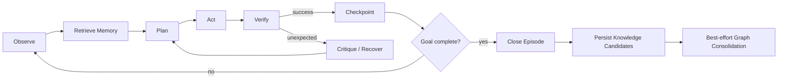

# Agent Runtime

## LangGraph state machine

## Logical roles
No crear microservicios por rol. Son nodes/capabilities:
- Story Analyzer
- Planner
- Explorer
- Browser Actor
- Observer
- Verifier
- Critic/Recovery
- Memory Retriever
- Experience Consolidator / Memory Writer
- Memory Feedback Recorder

## Verification priority
1. Deterministic assertion.
2. Structural DOM/accessibility assertion.
3. Network/API evidence.
4. Visual assertion.
5. LLM semantic judgment.

## Episodes
Dividir runs largos en episodios con summary + checkpoint + knowledge candidate extraction. Ejemplos: authentication, navigation discovery, user management, permissions, regression.

El planner consume un `MemoryContext` bounded y con provenance. Tras ejecutar memoria/playbook, el verifier produce feedback determinista para refinar reliability/invalidation. El graph write queda fuera de la ventana crítica de side effects del browser.
