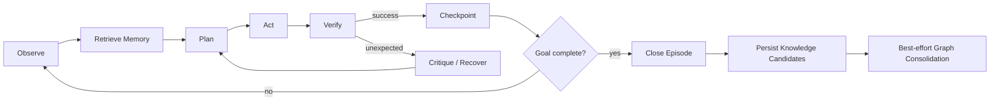

# Agent Runtime

## LangGraph state machine

## Logical roles
No crear microservicios por rol. Son nodes/capabilities:
- Story Analyzer
- Planner
- Explorer
- Browser Actor
- Observer
- Verifier
- Critic/Recovery
- Memory Retriever
- Experience Consolidator / Memory Writer
- Memory Feedback Recorder

## Outcomes de un step
`StepOutcome` distingue tres cosas que no deben colapsarse:
- `SUCCEEDED` → Checkpoint.
- `FAILED` → Recover (retry semántico acotado, ver ADR 0009).
- `DENIED` → cierre del episodio. Una acción rechazada por la RunPolicy no se reintenta ni se
  replanifica: volver a pedirle al modelo otra ruta es exactamente el comportamiento que la policy
  existe para impedir. Tampoco escapa como excepción, porque eso haría que Temporal reintentara el
  episodio como fallo de infraestructura.

## Exploration mode (Phase 12)

Un episodio explora **o** planifica; nunca las dos cosas. Se elige al construir el graph, no
por step, así que ningún nodo tiene que preguntar en qué clase de episodio está: el borde
`START` va a `explore` en vez de a `observe`, y `explore` reemplaza al planner.

- **Cero inferencia.** El frontier decide desde lo que la página ofrece. Explorar una
  aplicación no cuesta ni una llamada al modelo, y está aseverado en cada test del modo.
- **Un estado es lo que la página ofrece**, no su DOM: ruta normalizada más el conjunto de
  affordances (role + accessible name, también normalizados). Una lista con una fila más es
  el mismo estado; una página con un control nuevo no lo es.
- **Termina por estructura, no por esperanza.** Una affordance se ofrece **una sola vez** y
  las de un estado se encolan sólo la primera vez que se ve. Dos páginas que se enlazan
  mutuamente y un sitio completamente conectado terminan igual; los budgets sólo acotan
  cuánto tarda.
- **La policy se consulta antes de ofrecer**, no después de intentar. Una acción denegada
  cierra el episodio por diseño, así que un explorador que encolara botones se detendría en
  el primero. Los links se siguen **navegando** (read-only) y los botones se **cuentan** como
  declinados. Sin eso, explorar exigiría `destructive_actions: true` y el default seguro
  sería el inútil.
- **El frontier se checkpointea** con su conjunto de affordances ya ofrecidas. Sin eso, una
  exploración reanudada podría caminar un ciclo de dos páginas para siempre — habiendo
  sobrevivido al crash y perdido la garantía.
- `describe_page()` lee el árbol de accesibilidad (`aria_snapshot`). No hay `evaluate`: el
  action set cerrado es el límite de seguridad, y un escape hatch de JS para comodidad del
  explorador sería un agujero que ninguna policy ve. Los hrefs se resuelven contra la URL de
  la página — uno relativo no tiene origin, y una allowlist preguntada por él sólo puede
  negar.

Explorar se **pide** (`explore: true` al crear el run), nunca se infiere de la ausencia de
plan: un run sin plan siempre significó "trabaja hacia este objetivo con el planner", y
convertirlo en silencio en un crawl determinista quitaría una capacidad que nadie pidió
perder.

Limitación conocida: el worker sólo construye un episode runner cuando hay endpoint de modelo
configurado, así que hoy explorar exige uno aunque no lo llame nunca.

## Verification priority
1. Deterministic assertion.
2. Structural DOM/accessibility assertion.
3. Network/API evidence.
4. Visual assertion.
5. LLM semantic judgment.

## Episodes
Dividir runs largos en episodios con summary + checkpoint + knowledge candidate extraction. Ejemplos: authentication, navigation discovery, user management, permissions, regression.

El planner consume un `MemoryContext` bounded y con provenance. Tras ejecutar memoria/playbook, el verifier produce feedback determinista para refinar reliability/invalidation. El graph write queda fuera de la ventana crítica de side effects del browser.
